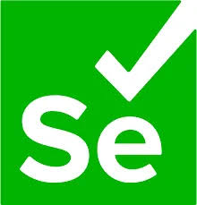
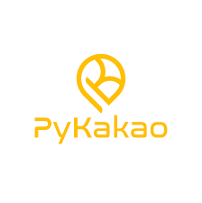
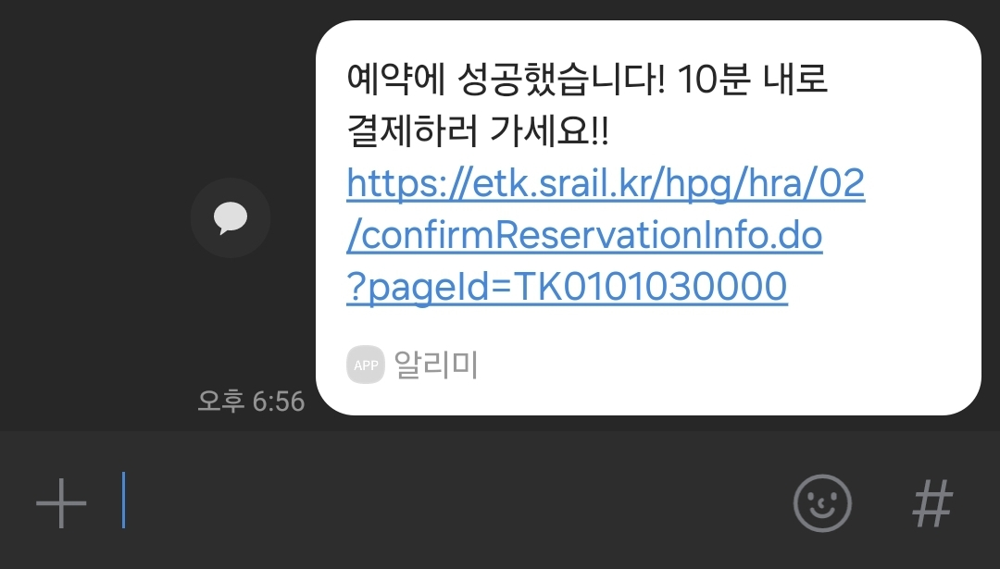

## STR 자동 예매 매크로 만들기
#### 활용 라이브러리
- selenium : to craw SRT data
  

- PyKakao : to send success message
  

#### 구현 flow
[PyKakao]
- 카카오 로그인
- 카카오로 너한테 메세지 보내도 되는지 auth 관련 code 받기

[selenium]
- SRT에 들어가요!
- 로그인을 합니다.
- 예매 페이지로 갑니다
- 원하는 출발지/도착지/시간 을 입력 시킵니다.
- 매진이 없어질때 까지 광클 합니다!

[PyKakao]
- 예약을 성공적으로 누르면 카카오톡에 메세지를 보냅니다

